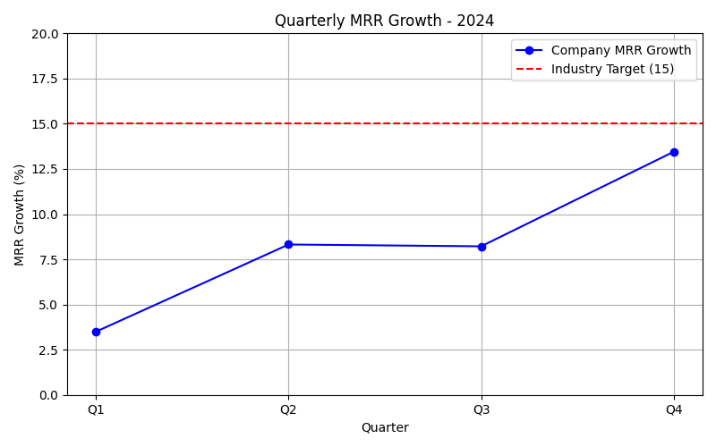

# SaaS Technology Performance Analysis

**Author / Verification Email:** 24f2000717@ds.study.iitm.ac.in

## Overview

The company is experiencing slowing Monthly Recurring Revenue (MRR) growth. This analysis examines quarterly performance for 2024 and compares it to the industry benchmark of 15% growth.

### Quarterly MRR Growth Data

| Quarter | MRR Growth (%) |
|---------|----------------|
| Q1      | 3.5            |
| Q2      | 8.32           |
| Q3      | 8.22           |
| Q4      | 13.45          |

**Average MRR Growth:** 8.37

**Industry Benchmark:** 15%

---

## Key Findings

1. **Overall Growth:** The company’s average MRR growth of 8.37% is significantly below the industry target of 15%.  
2. **Trend Analysis:** MRR growth improved over the year (Q1: 3.5% → Q4: 13.45%) but still falls short of the benchmark.  
3. **Quarterly Insights:**  
   - Q1 showed slow growth (3.5%) indicating potential early-year challenges.  
   - Q2 and Q3 stabilized around 8%, showing consistent but subpar performance.  
   - Q4 growth jumped to 13.45%, indicating that recent strategic actions are yielding results.

---

## Business Implications

- Current growth is insufficient to meet industry standards, which could impact competitive positioning.  
- Slow growth may limit the ability to reinvest in product development and marketing.  
- The upward trend in Q4 suggests that targeted initiatives can produce meaningful improvements.

---

## Recommendations

**Primary Solution:** Expand into new market segments to capture untapped opportunities and accelerate MRR growth.  

**Specific Actions:**
1. Identify underrepresented geographic regions and verticals.
2. Launch targeted marketing campaigns and localized offerings.
3. Enhance onboarding and customer success efforts to improve retention in new markets.
4. Monitor MRR growth quarterly and adjust strategies based on real-time data.

---

## Visualization

*Quarterly MRR Growth vs Industry Benchmark (15%)*